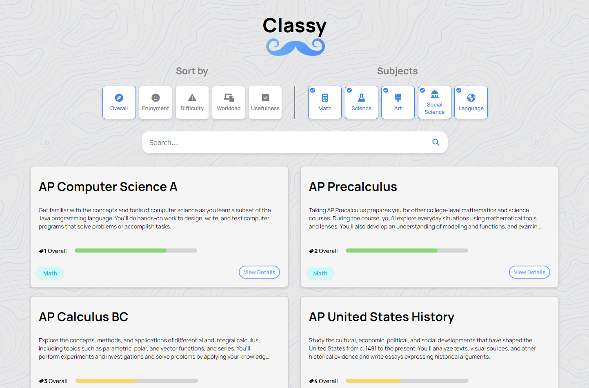
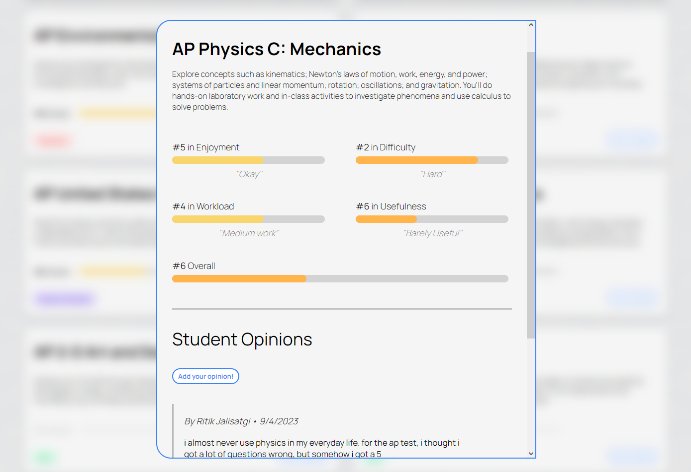

# project-classy
Project Classy lets students view, and review, courses through metrics such as Difficulty, Enjoyment, Usefulness, and Workload
<h1><a id="title" href="https://projectclassy.live" target="_blank">https://projectclassy.live</a></h1>
</img>
</img>
